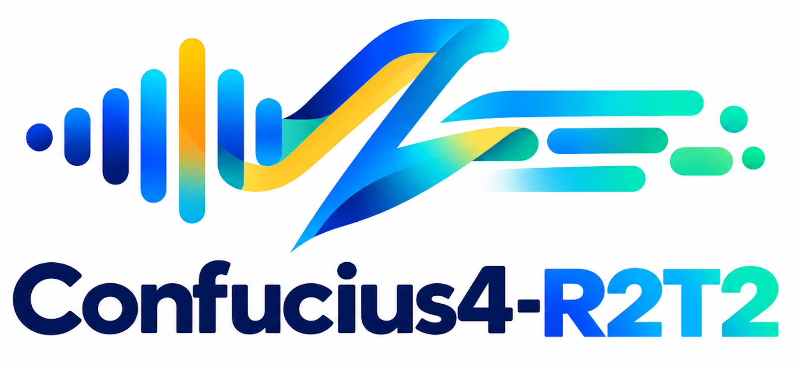
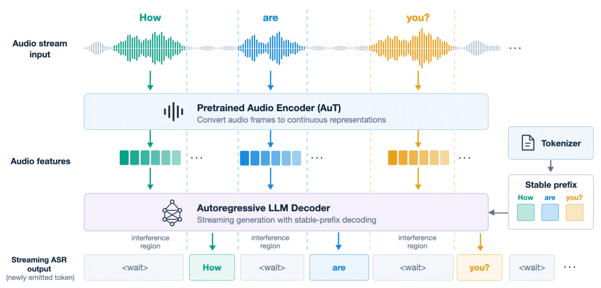
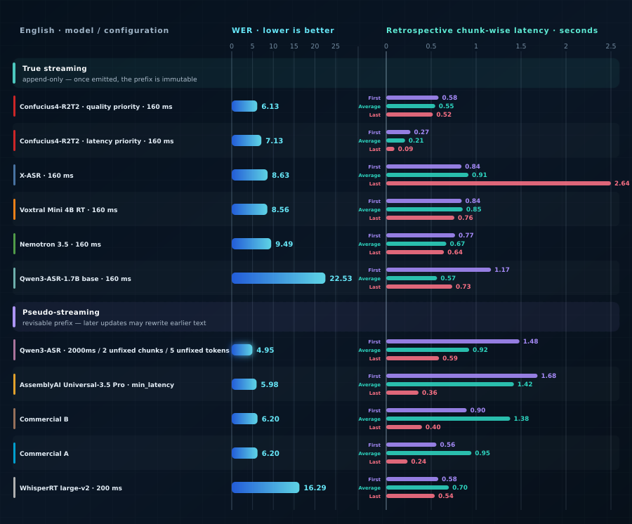
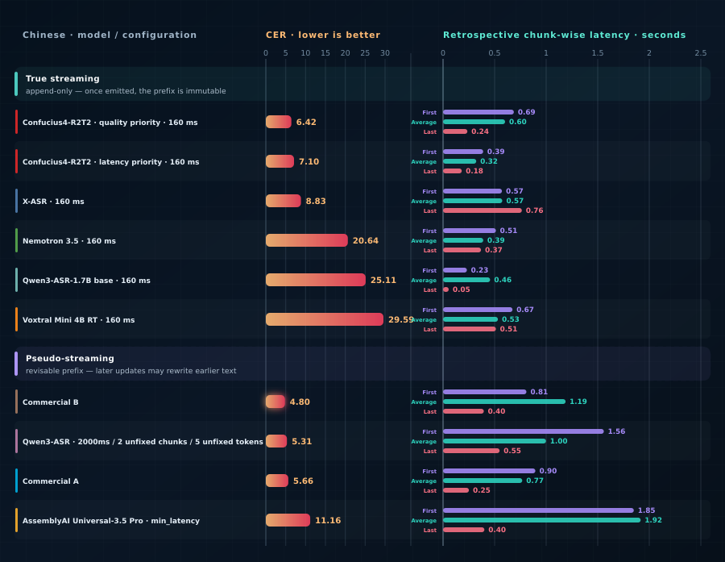
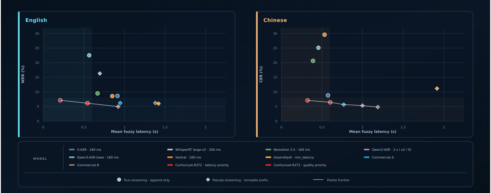

<div align="center">
    
    <h1>Confucius4-<span style="color: #4F8CFF;">R2T2</span>: A Low Latency and High Accuracy Real-Time Speech Recognition Model</h1>
        <p>
        <b>
            <span style="color: #4F8CFF;">R</span>eal
            <span style="color: #4F8CFF;">R</span>eal-<span style="color: #4F8CFF;">T</span>ime
            <span style="color: #4F8CFF;">T</span>ranscription
        </b>
    </p>
</div>

<div align="center">
    <a href="./README.md"></a>
    &nbsp;&nbsp;&nbsp;&nbsp;
    <a href="./LICENSE"></a>
    &nbsp;&nbsp;&nbsp;&nbsp;
    <a href="https://r2t2.youdao.com/demo"></a>
    &nbsp;&nbsp;&nbsp;&nbsp;
    <a href="https://huggingface.co/netease-youdao/Confucius4-R2T2"></a>
    &nbsp;&nbsp;&nbsp;&nbsp;
    <a href="https://modelscope.cn/models/netease-youdao/Confucius4-R2T2"></a>
    &nbsp;&nbsp;&nbsp;&nbsp;
    <a href="https://r2t2.ai/"></a>
    &nbsp;&nbsp;&nbsp;&nbsp;
</div>
<br>

Confucius4-R2T2 是一款低延迟、高准确率的真流式自动语音识别（ASR）模型，支持以 80 毫秒到 2 秒的不同细粒度音频步长进行流式解码。该模型输出模式为真流式：即已提交的识别文本稳定不变，且无需后续修正，这对于识别文本必须被即时处理或执行操作的语音交互应用场景至关重要，例如实时字幕与听写、下游 NLP 流水线与 LLM 智能体、同声传译等等。这种真流式可带来更流畅的用户体验，避免实时应用中频繁修改文本和界面闪烁等问题。

R2T2 是 Real Real-Time Transcription（真正实时转写）的缩写，构建于 Qwen3-ASR 模型之上。它采用了一套独特的数据构造技术进行训练，包括稳定前缀数据、强制时间对齐数据以及词元级音频切分数据。通过结合最长稳定前缀（Longest Stable Prefix，LSP）学习范式，R2T2 能够动态判断何时可以安全地输出稳定前缀，以及何时仍需等待更多的音频上下文（相关技术报告即将发布）。并且，在识别过程中通过仅输出稳定的前缀识别文本，这为模型的后续预测提供了高质量的上下文，从而有助于识别更加准确的新增识别文本，最终实现低延时、高质量、真正流式的语音识别效果。此外，尽管模型主要针对流式场景进行优化，但是 R2T2 在离线识别场景下同样保持了出色的准确率。

- **低延迟高准确率流式识别** — 准确率接近离线识别，平均延迟仅 200 至 600 毫秒。
- **稳定的流式输出** — 文本一旦输出即被提交，后续保持不变。
- **可配置的低延迟分块** — 支持 80 毫秒至 2 秒的解码分块，以权衡不同的延迟与准确率。
- **离线识别准确率无损** — 增加流式支持不会降低离线识别准确率。
- **vLLM 后端** — 提供高吞吐推理，同时提供 Hugging Face `transformers` 后端。
- **上下文和热词提示** — 原生支持。
- **多语言支持** — 针对 **中文和英文** 进行了优化，同时支持广泛的其他语言。

实验结果表明，R2T2 在一系列开源模型中，在延迟和识别质量两方面均达到了当前最佳（SOTA）水平，同时与领先的闭源系统相比也具备竞争力。本仓库提供推理代码、最小化使用示例，以及一个基于 vLLM 的后端，支持离线推理和实时流式推理。

## 目录

- [概览](#概览)
- [演示](#演示)
  - [与 GPT-Live-Transcribe 的并排对比](#与-gpt-live-transcribe-的并排对比)
  - [其他资源](#其他资源)
- [评测](#评测)
  - [流式性能](#流式性能)
  - [准确率](#准确率)
    - [英文](#英文)
    - [中文](#中文)
- [安装](#安装)
  - [克隆仓库](#克隆仓库)
  - [方式 1: Conda](#方式-1-conda)
  - [方式 2: uv](#方式-2-uv)
- [Docker（推荐）](#docker推荐)
  - [1. 启动容器](#1-启动容器)
  - [2. 在容器中运行示例](#2-在容器中运行示例)
  - [3. 管理容器](#3-管理容器)
- [快速开始](#快速开始)
  - [配置](#配置)
- [Python API](#python-api)
  - [离线转写（vLLM 后端）](#离线转写vllm-后端)
  - [流式转写（vLLM 后端）](#流式转写vllm-后端)
- [WebSocket 服务](#websocket-服务)
  - [启动与停止服务](#启动与停止服务)
  - [WebSocket 端点](#websocket-端点)
  - [消息格式](#消息格式)
  - [客户端示例](#客户端示例)
- [支持的语言](#支持的语言)
- [社区与联系](#社区与联系)
  - [微信群](#微信群)
  - [Discord 社区](#discord-社区)
  - [商务联系](#商务联系)
  - [GitHub Issues](#github-issues)
- [致谢](#致谢)
- [引用](#引用)
- [许可证](#许可证)

---

## 概览

<div align="center">
<p align="center">
  
</p>
<p align="center">
  <i>图 1：R2T2 总体框架。</i>
</p>
</div>

## 演示

### 与 GPT-Live-Transcribe 的并排对比

<div align="center">
  <video controls playsinline preload="metadata" width="90%" src="https://github.com/user-attachments/assets/1b21c04a-766a-434f-96dc-580376b305f1" title="GPT-Live-Transcribe 与 R2T2 同时实时处理相同音频的并排对比。">
    <!-- GitLab 会将此备用图像转换为视频播放器。 -->
    
  </video>
  <p><i>图 2：GPT-Live-Transcribe 与 R2T2 同时实时处理相同音频的对比。</i></p>
</div>

### 其他资源

更多演示、对比和相关资源将在此处持续添加。

## 评测

> 如果您是本对比中所评测模型的作者或维护者，并对结果有任何疑问或意见，欢迎通过仓库的 issue tracker 联系我们。我们很乐意分享评测细节，并与您共同核实或更正结果。

### 流式性能

流式 API 支持 80 毫秒至 2 秒的解码分块；下方图表展示在 160 毫秒下具有代表性的 WER/延迟权衡。

<div align="center">
  
  <p><i>图 3：不同模型与配置设置下的英文 WER 和回溯式分块延迟。</i></p>
</div>

<div align="center">
  
  <p><i>图 4：不同模型与配置设置下的中文 WER 和回溯式分块延迟。</i></p>
</div>

<div align="center">
  
  <p><i>图 5：精度 - 延迟帕累托前沿。左下方向代表性能更优；该前沿采用回溯式分块平均模糊延迟计算。</i></p>
</div>

### 准确率

英文结果使用 WER（%），中文结果使用 CER（%）；数值越低越好。

※ 伪流式模型：其部分识别结果可能修改此前已输出的文本；未标记的模型均采用文本只追加、不回改的真流式输出。

#### English

<div align="center">
<table style="border-collapse: collapse; width: 100%; margin: 14px 0 28px; font-size: 13px; line-height: 1.35;">
<colgroup><col style="width: 14%;"><col span="10" style="width: 8.6%;"></colgroup>
<thead><tr>
<th rowspan="2" style="padding: 8px 9px; text-align: center; font-weight: 700; border-bottom: 1px solid #8c959f; vertical-align: middle;" scope="col" align="left">Dataset</th>
<th colspan="2" style="padding: 8px 9px; text-align: center; font-weight: 700; border-bottom: 1px solid #8c959f; vertical-align: middle; border-left: 1px solid #d0d7de;" scope="colgroup" align="center">Qwen</th>
<th rowspan="2" style="padding: 7px 9px; text-align: center; font-weight: 600; border-bottom: 2px solid #8c959f; vertical-align: middle;" scope="col" align="center">R2T2 (ours)<br><sub>160ms</sub></th>
<th colspan="4" style="padding: 8px 9px; text-align: center; font-weight: 700; border-bottom: 1px solid #8c959f; vertical-align: middle; border-left: 1px solid #d0d7de;" scope="colgroup" align="center">Open-source</th>
<th colspan="3" style="padding: 8px 9px; text-align: center; font-weight: 700; border-bottom: 1px solid #8c959f; vertical-align: middle; border-left: 1px solid #d0d7de;" scope="colgroup" align="center">Proprietary</th>
</tr><tr>
<th style="padding: 7px 9px; text-align: center; font-weight: 600; border-bottom: 2px solid #8c959f; vertical-align: middle; border-left: 1px solid #d0d7de;" scope="col" align="center">Qwen3-ASR※<br><sub>2s/u2/t5</sub></th>
<th style="padding: 7px 9px; text-align: center; font-weight: 600; border-bottom: 2px solid #8c959f; vertical-align: middle;" scope="col" align="center">Qwen3-ASR base<br><sub>160ms</sub></th>
<th style="padding: 7px 9px; text-align: center; font-weight: 600; border-bottom: 2px solid #8c959f; vertical-align: middle; border-left: 1px solid #d0d7de;" scope="col" align="center">X-ASR<br><sub>160ms</sub></th>
<th style="padding: 7px 9px; text-align: center; font-weight: 600; border-bottom: 2px solid #8c959f; vertical-align: middle;" scope="col" align="center">WhisperRT※<br><sub>200ms</sub></th>
<th style="padding: 7px 9px; text-align: center; font-weight: 600; border-bottom: 2px solid #8c959f; vertical-align: middle;" scope="col" align="center">Nemotron<br><sub>160ms</sub></th>
<th style="padding: 7px 9px; text-align: center; font-weight: 600; border-bottom: 2px solid #8c959f; vertical-align: middle;" scope="col" align="center">Voxtral<br><sub>160ms</sub></th>
<th style="padding: 7px 9px; text-align: center; font-weight: 600; border-bottom: 2px solid #8c959f; vertical-align: middle; border-left: 1px solid #d0d7de;" scope="col" align="center">AssemblyAI※<br><sub>min_latency</sub></th>
<th style="padding: 7px 9px; text-align: center; font-weight: 600; border-bottom: 2px solid #8c959f; vertical-align: middle;" scope="col" align="center">Commercial A※</th>
<th style="padding: 7px 9px; text-align: center; font-weight: 600; border-bottom: 2px solid #8c959f; vertical-align: middle;" scope="col" align="center">Commercial B※</th>
</tr></thead><tbody>
<tr>
<th style="padding: 7px 9px; border-bottom: 1px solid #d0d7de; vertical-align: middle; font-weight: 600;" scope="row" align="left">AMI</th>
<td style="padding: 7px 9px; border-bottom: 1px solid #d0d7de; vertical-align: middle; border-left: 1px solid #d0d7de;" align="center">9.25</td>
<td style="padding: 7px 9px; border-bottom: 1px solid #d0d7de; vertical-align: middle;" align="center">24.79</td>
<td style="padding: 7px 9px; border-bottom: 1px solid #d0d7de; vertical-align: middle;" align="center"><code>11.37</code></td>
<td style="padding: 7px 9px; border-bottom: 1px solid #d0d7de; vertical-align: middle; border-left: 1px solid #d0d7de;" align="center">14.41</td>
<td style="padding: 7px 9px; border-bottom: 1px solid #d0d7de; vertical-align: middle;" align="center">24.19</td>
<td style="padding: 7px 9px; border-bottom: 1px solid #d0d7de; vertical-align: middle;" align="center">18.11</td>
<td style="padding: 7px 9px; border-bottom: 1px solid #d0d7de; vertical-align: middle;" align="center">15.94</td>
<td style="padding: 7px 9px; border-bottom: 1px solid #d0d7de; vertical-align: middle; border-left: 1px solid #d0d7de;" align="center">12.00</td>
<td style="padding: 7px 9px; border-bottom: 1px solid #d0d7de; vertical-align: middle;" align="center">13.27</td>
<td style="padding: 7px 9px; border-bottom: 1px solid #d0d7de; vertical-align: middle;" align="center">8.44</td>
</tr>
<tr>
<th style="padding: 7px 9px; border-bottom: 1px solid #d0d7de; vertical-align: middle; font-weight: 600;" scope="row" align="left">Giga-clean</th>
<td style="padding: 7px 9px; border-bottom: 1px solid #d0d7de; vertical-align: middle; border-left: 1px solid #d0d7de;" align="center">8.61</td>
<td style="padding: 7px 9px; border-bottom: 1px solid #d0d7de; vertical-align: middle;" align="center">24.37</td>
<td style="padding: 7px 9px; border-bottom: 1px solid #d0d7de; vertical-align: middle;" align="center"><code>9.60</code></td>
<td style="padding: 7px 9px; border-bottom: 1px solid #d0d7de; vertical-align: middle; border-left: 1px solid #d0d7de;" align="center">10.26</td>
<td style="padding: 7px 9px; border-bottom: 1px solid #d0d7de; vertical-align: middle;" align="center">13.81</td>
<td style="padding: 7px 9px; border-bottom: 1px solid #d0d7de; vertical-align: middle;" align="center">12.67</td>
<td style="padding: 7px 9px; border-bottom: 1px solid #d0d7de; vertical-align: middle;" align="center">11.13</td>
<td style="padding: 7px 9px; border-bottom: 1px solid #d0d7de; vertical-align: middle; border-left: 1px solid #d0d7de;" align="center">9.21</td>
<td style="padding: 7px 9px; border-bottom: 1px solid #d0d7de; vertical-align: middle;" align="center">8.84</td>
<td style="padding: 7px 9px; border-bottom: 1px solid #d0d7de; vertical-align: middle;" align="center">9.46</td>
</tr>
<tr>
<th style="padding: 7px 9px; border-bottom: 1px solid #d0d7de; vertical-align: middle; font-weight: 600;" scope="row" align="left">LS-clean</th>
<td style="padding: 7px 9px; border-bottom: 1px solid #d0d7de; vertical-align: middle; border-left: 1px solid #d0d7de;" align="center">1.67</td>
<td style="padding: 7px 9px; border-bottom: 1px solid #d0d7de; vertical-align: middle;" align="center">22.30</td>
<td style="padding: 7px 9px; border-bottom: 1px solid #d0d7de; vertical-align: middle;" align="center"><code>2.13</code></td>
<td style="padding: 7px 9px; border-bottom: 1px solid #d0d7de; vertical-align: middle; border-left: 1px solid #d0d7de;" align="center">3.86</td>
<td style="padding: 7px 9px; border-bottom: 1px solid #d0d7de; vertical-align: middle;" align="center">4.70</td>
<td style="padding: 7px 9px; border-bottom: 1px solid #d0d7de; vertical-align: middle;" align="center">3.71</td>
<td style="padding: 7px 9px; border-bottom: 1px solid #d0d7de; vertical-align: middle;" align="center">2.49</td>
<td style="padding: 7px 9px; border-bottom: 1px solid #d0d7de; vertical-align: middle; border-left: 1px solid #d0d7de;" align="center">1.89</td>
<td style="padding: 7px 9px; border-bottom: 1px solid #d0d7de; vertical-align: middle;" align="center">1.73</td>
<td style="padding: 7px 9px; border-bottom: 1px solid #d0d7de; vertical-align: middle;" align="center">1.25</td>
</tr>
<tr>
<th style="padding: 7px 9px; border-bottom: 1px solid #d0d7de; vertical-align: middle; font-weight: 600;" scope="row" align="left">LS-other</th>
<td style="padding: 7px 9px; border-bottom: 1px solid #d0d7de; vertical-align: middle; border-left: 1px solid #d0d7de;" align="center">3.54</td>
<td style="padding: 7px 9px; border-bottom: 1px solid #d0d7de; vertical-align: middle;" align="center">25.74</td>
<td style="padding: 7px 9px; border-bottom: 1px solid #d0d7de; vertical-align: middle;" align="center"><code>4.88</code></td>
<td style="padding: 7px 9px; border-bottom: 1px solid #d0d7de; vertical-align: middle; border-left: 1px solid #d0d7de;" align="center">9.64</td>
<td style="padding: 7px 9px; border-bottom: 1px solid #d0d7de; vertical-align: middle;" align="center">9.86</td>
<td style="padding: 7px 9px; border-bottom: 1px solid #d0d7de; vertical-align: middle;" align="center">8.27</td>
<td style="padding: 7px 9px; border-bottom: 1px solid #d0d7de; vertical-align: middle;" align="center">7.15</td>
<td style="padding: 7px 9px; border-bottom: 1px solid #d0d7de; vertical-align: middle; border-left: 1px solid #d0d7de;" align="center">3.37</td>
<td style="padding: 7px 9px; border-bottom: 1px solid #d0d7de; vertical-align: middle;" align="center">3.57</td>
<td style="padding: 7px 9px; border-bottom: 1px solid #d0d7de; vertical-align: middle;" align="center">2.48</td>
</tr>
<tr>
<th style="padding: 7px 9px; border-bottom: 1px solid #d0d7de; vertical-align: middle; font-weight: 600;" scope="row" align="left">SPGI</th>
<td style="padding: 7px 9px; border-bottom: 1px solid #d0d7de; vertical-align: middle; border-left: 1px solid #d0d7de;" align="center">2.90</td>
<td style="padding: 7px 9px; border-bottom: 1px solid #d0d7de; vertical-align: middle;" align="center">22.25</td>
<td style="padding: 7px 9px; border-bottom: 1px solid #d0d7de; vertical-align: middle;" align="center"><code>3.00</code></td>
<td style="padding: 7px 9px; border-bottom: 1px solid #d0d7de; vertical-align: middle; border-left: 1px solid #d0d7de;" align="center">5.14</td>
<td style="padding: 7px 9px; border-bottom: 1px solid #d0d7de; vertical-align: middle;" align="center">8.66</td>
<td style="padding: 7px 9px; border-bottom: 1px solid #d0d7de; vertical-align: middle;" align="center">3.93</td>
<td style="padding: 7px 9px; border-bottom: 1px solid #d0d7de; vertical-align: middle;" align="center">3.06</td>
<td style="padding: 7px 9px; border-bottom: 1px solid #d0d7de; vertical-align: middle; border-left: 1px solid #d0d7de;" align="center">2.14</td>
<td style="padding: 7px 9px; border-bottom: 1px solid #d0d7de; vertical-align: middle;" align="center">3.06</td>
<td style="padding: 7px 9px; border-bottom: 1px solid #d0d7de; vertical-align: middle;" align="center">1.74</td>
</tr>
<tr>
<th style="padding: 7px 9px; border-bottom: 1px solid #d0d7de; vertical-align: middle; font-weight: 600;" scope="row" align="left">VoxPopuli</th>
<td style="padding: 7px 9px; border-bottom: 1px solid #d0d7de; vertical-align: middle; border-left: 1px solid #d0d7de;" align="center">3.02</td>
<td style="padding: 7px 9px; border-bottom: 1px solid #d0d7de; vertical-align: middle;" align="center">20.71</td>
<td style="padding: 7px 9px; border-bottom: 1px solid #d0d7de; vertical-align: middle;" align="center"><code>3.07</code></td>
<td style="padding: 7px 9px; border-bottom: 1px solid #d0d7de; vertical-align: middle; border-left: 1px solid #d0d7de;" align="center">5.68</td>
<td style="padding: 7px 9px; border-bottom: 1px solid #d0d7de; vertical-align: middle;" align="center">8.28</td>
<td style="padding: 7px 9px; border-bottom: 1px solid #d0d7de; vertical-align: middle;" align="center">5.69</td>
<td style="padding: 7px 9px; border-bottom: 1px solid #d0d7de; vertical-align: middle;" align="center">6.30</td>
<td style="padding: 7px 9px; border-bottom: 1px solid #d0d7de; vertical-align: middle; border-left: 1px solid #d0d7de;" align="center">4.75</td>
<td style="padding: 7px 9px; border-bottom: 1px solid #d0d7de; vertical-align: middle;" align="center">3.17</td>
<td style="padding: 7px 9px; border-bottom: 1px solid #d0d7de; vertical-align: middle;" align="center">3.14</td>
</tr>
<tr>
<th style="padding: 7px 9px; border-bottom: 1px solid #d0d7de; vertical-align: middle; font-weight: 600;" scope="row" align="left">Earnings22</th>
<td style="padding: 7px 9px; border-bottom: 1px solid #d0d7de; vertical-align: middle; border-left: 1px solid #d0d7de;" align="center">6.68</td>
<td style="padding: 7px 9px; border-bottom: 1px solid #d0d7de; vertical-align: middle;" align="center">29.72</td>
<td style="padding: 7px 9px; border-bottom: 1px solid #d0d7de; vertical-align: middle;" align="center"><code>9.36</code></td>
<td style="padding: 7px 9px; border-bottom: 1px solid #d0d7de; vertical-align: middle; border-left: 1px solid #d0d7de;" align="center">15.95</td>
<td style="padding: 7px 9px; border-bottom: 1px solid #d0d7de; vertical-align: middle;" align="center">35.08</td>
<td style="padding: 7px 9px; border-bottom: 1px solid #d0d7de; vertical-align: middle;" align="center">17.22</td>
<td style="padding: 7px 9px; border-bottom: 1px solid #d0d7de; vertical-align: middle;" align="center">11.66</td>
<td style="padding: 7px 9px; border-bottom: 1px solid #d0d7de; vertical-align: middle; border-left: 1px solid #d0d7de;" align="center">7.47</td>
<td style="padding: 7px 9px; border-bottom: 1px solid #d0d7de; vertical-align: middle;" align="center">10.32</td>
<td style="padding: 7px 9px; border-bottom: 1px solid #d0d7de; vertical-align: middle;" align="center">8.96</td>
</tr>
<tr>
<th style="padding: 7px 9px; border-bottom: 1px solid #d0d7de; vertical-align: middle; font-weight: 600;" scope="row" align="left">TED-LIUM</th>
<td style="padding: 7px 9px; border-bottom: 1px solid #d0d7de; vertical-align: middle; border-left: 1px solid #d0d7de;" align="center">2.33</td>
<td style="padding: 7px 9px; border-bottom: 1px solid #d0d7de; vertical-align: middle;" align="center">19.18</td>
<td style="padding: 7px 9px; border-bottom: 1px solid #d0d7de; vertical-align: middle;" align="center"><code>3.34</code></td>
<td style="padding: 7px 9px; border-bottom: 1px solid #d0d7de; vertical-align: middle; border-left: 1px solid #d0d7de;" align="center">3.75</td>
<td style="padding: 7px 9px; border-bottom: 1px solid #d0d7de; vertical-align: middle;" align="center">6.67</td>
<td style="padding: 7px 9px; border-bottom: 1px solid #d0d7de; vertical-align: middle;" align="center">5.11</td>
<td style="padding: 7px 9px; border-bottom: 1px solid #d0d7de; vertical-align: middle;" align="center">4.60</td>
<td style="padding: 7px 9px; border-bottom: 1px solid #d0d7de; vertical-align: middle; border-left: 1px solid #d0d7de;" align="center">3.23</td>
<td style="padding: 7px 9px; border-bottom: 1px solid #d0d7de; vertical-align: middle;" align="center">3.08</td>
<td style="padding: 7px 9px; border-bottom: 1px solid #d0d7de; vertical-align: middle;" align="center">3.30</td>
</tr>
<tr>
<th style="padding: 7px 9px; border-bottom: 1px solid #d0d7de; vertical-align: middle; font-weight: 600;" scope="row" align="left">EN-RealSI</th>
<td style="padding: 7px 9px; border-bottom: 1px solid #d0d7de; vertical-align: middle; border-left: 1px solid #d0d7de;" align="center">6.54</td>
<td style="padding: 7px 9px; border-bottom: 1px solid #d0d7de; vertical-align: middle;" align="center">13.75</td>
<td style="padding: 7px 9px; border-bottom: 1px solid #d0d7de; vertical-align: middle;" align="center"><code>8.40</code></td>
<td style="padding: 7px 9px; border-bottom: 1px solid #d0d7de; vertical-align: middle; border-left: 1px solid #d0d7de;" align="center">8.97</td>
<td style="padding: 7px 9px; border-bottom: 1px solid #d0d7de; vertical-align: middle;" align="center">35.36</td>
<td style="padding: 7px 9px; border-bottom: 1px solid #d0d7de; vertical-align: middle;" align="center">10.69</td>
<td style="padding: 7px 9px; border-bottom: 1px solid #d0d7de; vertical-align: middle;" align="center">14.75</td>
<td style="padding: 7px 9px; border-bottom: 1px solid #d0d7de; vertical-align: middle; border-left: 1px solid #d0d7de;" align="center">9.73</td>
<td style="padding: 7px 9px; border-bottom: 1px solid #d0d7de; vertical-align: middle;" align="center">8.73</td>
<td style="padding: 7px 9px; border-bottom: 1px solid #d0d7de; vertical-align: middle;" align="center">17.05</td>
</tr>
</tbody></table></div>

#### Chinese

<div align="center">
<table style="border-collapse: collapse; width: 100%; margin: 14px 0 28px; font-size: 13px; line-height: 1.35;">
<colgroup><col style="width: 14%;"><col span="10" style="width: 8.6%;"></colgroup>
<thead><tr>
<th rowspan="2" style="padding: 8px 9px; text-align: center; font-weight: 700; border-bottom: 1px solid #8c959f; vertical-align: middle;" scope="col" align="left">Dataset</th>
<th colspan="2" style="padding: 8px 9px; text-align: center; font-weight: 700; border-bottom: 1px solid #8c959f; vertical-align: middle; border-left: 1px solid #d0d7de;" scope="colgroup" align="center">Qwen</th>
<th rowspan="2" style="padding: 7px 9px; text-align: center; font-weight: 600; border-bottom: 2px solid #8c959f; vertical-align: middle;" scope="col" align="center">R2T2 (ours)<br><sub>160ms</sub></th>
<th colspan="4" style="padding: 8px 9px; text-align: center; font-weight: 700; border-bottom: 1px solid #8c959f; vertical-align: middle; border-left: 1px solid #d0d7de;" scope="colgroup" align="center">Open-source</th>
<th colspan="3" style="padding: 8px 9px; text-align: center; font-weight: 700; border-bottom: 1px solid #8c959f; vertical-align: middle; border-left: 1px solid #d0d7de;" scope="colgroup" align="center">Proprietary</th>
</tr><tr>
<th style="padding: 7px 9px; text-align: center; font-weight: 600; border-bottom: 2px solid #8c959f; vertical-align: middle; border-left: 1px solid #d0d7de;" scope="col" align="center">Qwen3-ASR※<br><sub>2s/u2/t5</sub></th>
<th style="padding: 7px 9px; text-align: center; font-weight: 600; border-bottom: 2px solid #8c959f; vertical-align: middle;" scope="col" align="center">Qwen3-ASR base<br><sub>160ms</sub></th>
<th style="padding: 7px 9px; text-align: center; font-weight: 600; border-bottom: 2px solid #8c959f; vertical-align: middle; border-left: 1px solid #d0d7de;" scope="col" align="center">X-ASR<br><sub>160ms</sub></th>
<th style="padding: 7px 9px; text-align: center; font-weight: 600; border-bottom: 2px solid #8c959f; vertical-align: middle;" scope="col" align="center">WhisperRT※<br><sub>200ms</sub></th>
<th style="padding: 7px 9px; text-align: center; font-weight: 600; border-bottom: 2px solid #8c959f; vertical-align: middle;" scope="col" align="center">Nemotron<br><sub>160ms</sub></th>
<th style="padding: 7px 9px; text-align: center; font-weight: 600; border-bottom: 2px solid #8c959f; vertical-align: middle;" scope="col" align="center">Voxtral<br><sub>160ms</sub></th>
<th style="padding: 7px 9px; text-align: center; font-weight: 600; border-bottom: 2px solid #8c959f; vertical-align: middle; border-left: 1px solid #d0d7de;" scope="col" align="center">AssemblyAI※<br><sub>min_latency</sub></th>
<th style="padding: 7px 9px; text-align: center; font-weight: 600; border-bottom: 2px solid #8c959f; vertical-align: middle;" scope="col" align="center">Commercial A※</th>
<th style="padding: 7px 9px; text-align: center; font-weight: 600; border-bottom: 2px solid #8c959f; vertical-align: middle;" scope="col" align="center">Commercial B※</th>
</tr></thead><tbody>
<tr>
<th style="padding: 7px 9px; border-bottom: 1px solid #d0d7de; vertical-align: middle; font-weight: 600;" scope="row" align="left">Wenet-net</th>
<td style="padding: 7px 9px; border-bottom: 1px solid #d0d7de; vertical-align: middle; border-left: 1px solid #d0d7de;" align="center">4.94</td>
<td style="padding: 7px 9px; border-bottom: 1px solid #d0d7de; vertical-align: middle;" align="center">19.79</td>
<td style="padding: 7px 9px; border-bottom: 1px solid #d0d7de; vertical-align: middle;" align="center"><code>5.87</code></td>
<td style="padding: 7px 9px; border-bottom: 1px solid #d0d7de; vertical-align: middle; border-left: 1px solid #d0d7de;" align="center">8.81</td>
<td style="padding: 7px 9px; border-bottom: 1px solid #d0d7de; vertical-align: middle;" align="center">U</td>
<td style="padding: 7px 9px; border-bottom: 1px solid #d0d7de; vertical-align: middle;" align="center">24.70</td>
<td style="padding: 7px 9px; border-bottom: 1px solid #d0d7de; vertical-align: middle;" align="center">23.53</td>
<td style="padding: 7px 9px; border-bottom: 1px solid #d0d7de; vertical-align: middle; border-left: 1px solid #d0d7de;" align="center">12.91</td>
<td style="padding: 7px 9px; border-bottom: 1px solid #d0d7de; vertical-align: middle;" align="center">5.13</td>
<td style="padding: 7px 9px; border-bottom: 1px solid #d0d7de; vertical-align: middle;" align="center">4.79</td>
</tr>
<tr>
<th style="padding: 7px 9px; border-bottom: 1px solid #d0d7de; vertical-align: middle; font-weight: 600;" scope="row" align="left">Wenet-meeting</th>
<td style="padding: 7px 9px; border-bottom: 1px solid #d0d7de; vertical-align: middle; border-left: 1px solid #d0d7de;" align="center">5.97</td>
<td style="padding: 7px 9px; border-bottom: 1px solid #d0d7de; vertical-align: middle;" align="center">20.38</td>
<td style="padding: 7px 9px; border-bottom: 1px solid #d0d7de; vertical-align: middle;" align="center"><code>7.27</code></td>
<td style="padding: 7px 9px; border-bottom: 1px solid #d0d7de; vertical-align: middle; border-left: 1px solid #d0d7de;" align="center">11.33</td>
<td style="padding: 7px 9px; border-bottom: 1px solid #d0d7de; vertical-align: middle;" align="center">U</td>
<td style="padding: 7px 9px; border-bottom: 1px solid #d0d7de; vertical-align: middle;" align="center">20.18</td>
<td style="padding: 7px 9px; border-bottom: 1px solid #d0d7de; vertical-align: middle;" align="center">60.54</td>
<td style="padding: 7px 9px; border-bottom: 1px solid #d0d7de; vertical-align: middle; border-left: 1px solid #d0d7de;" align="center">11.84</td>
<td style="padding: 7px 9px; border-bottom: 1px solid #d0d7de; vertical-align: middle;" align="center">7.07</td>
<td style="padding: 7px 9px; border-bottom: 1px solid #d0d7de; vertical-align: middle;" align="center">3.75</td>
</tr>
<tr>
<th style="padding: 7px 9px; border-bottom: 1px solid #d0d7de; vertical-align: middle; font-weight: 600;" scope="row" align="left">SPEECHIO-06</th>
<td style="padding: 7px 9px; border-bottom: 1px solid #d0d7de; vertical-align: middle; border-left: 1px solid #d0d7de;" align="center">6.10</td>
<td style="padding: 7px 9px; border-bottom: 1px solid #d0d7de; vertical-align: middle;" align="center">24.50</td>
<td style="padding: 7px 9px; border-bottom: 1px solid #d0d7de; vertical-align: middle;" align="center"><code>7.30</code></td>
<td style="padding: 7px 9px; border-bottom: 1px solid #d0d7de; vertical-align: middle; border-left: 1px solid #d0d7de;" align="center">7.86</td>
<td style="padding: 7px 9px; border-bottom: 1px solid #d0d7de; vertical-align: middle;" align="center">U</td>
<td style="padding: 7px 9px; border-bottom: 1px solid #d0d7de; vertical-align: middle;" align="center">22.52</td>
<td style="padding: 7px 9px; border-bottom: 1px solid #d0d7de; vertical-align: middle;" align="center">32.16</td>
<td style="padding: 7px 9px; border-bottom: 1px solid #d0d7de; vertical-align: middle; border-left: 1px solid #d0d7de;" align="center">15.08</td>
<td style="padding: 7px 9px; border-bottom: 1px solid #d0d7de; vertical-align: middle;" align="center">5.67</td>
<td style="padding: 7px 9px; border-bottom: 1px solid #d0d7de; vertical-align: middle;" align="center">5.34</td>
</tr>
<tr>
<th style="padding: 7px 9px; border-bottom: 1px solid #d0d7de; vertical-align: middle; font-weight: 600;" scope="row" align="left">SPEECHIO-07</th>
<td style="padding: 7px 9px; border-bottom: 1px solid #d0d7de; vertical-align: middle; border-left: 1px solid #d0d7de;" align="center">6.19</td>
<td style="padding: 7px 9px; border-bottom: 1px solid #d0d7de; vertical-align: middle;" align="center">21.16</td>
<td style="padding: 7px 9px; border-bottom: 1px solid #d0d7de; vertical-align: middle;" align="center"><code>8.20</code></td>
<td style="padding: 7px 9px; border-bottom: 1px solid #d0d7de; vertical-align: middle; border-left: 1px solid #d0d7de;" align="center">11.22</td>
<td style="padding: 7px 9px; border-bottom: 1px solid #d0d7de; vertical-align: middle;" align="center">U</td>
<td style="padding: 7px 9px; border-bottom: 1px solid #d0d7de; vertical-align: middle;" align="center">24.28</td>
<td style="padding: 7px 9px; border-bottom: 1px solid #d0d7de; vertical-align: middle;" align="center">22.97</td>
<td style="padding: 7px 9px; border-bottom: 1px solid #d0d7de; vertical-align: middle; border-left: 1px solid #d0d7de;" align="center">10.84</td>
<td style="padding: 7px 9px; border-bottom: 1px solid #d0d7de; vertical-align: middle;" align="center">6.45</td>
<td style="padding: 7px 9px; border-bottom: 1px solid #d0d7de; vertical-align: middle;" align="center">6.46</td>
</tr>
<tr>
<th style="padding: 7px 9px; border-bottom: 1px solid #d0d7de; vertical-align: middle; font-weight: 600;" scope="row" align="left">CN-RealSI</th>
<td style="padding: 7px 9px; border-bottom: 1px solid #d0d7de; vertical-align: middle; border-left: 1px solid #d0d7de;" align="center">3.34</td>
<td style="padding: 7px 9px; border-bottom: 1px solid #d0d7de; vertical-align: middle;" align="center">39.72</td>
<td style="padding: 7px 9px; border-bottom: 1px solid #d0d7de; vertical-align: middle;" align="center"><code>3.48</code></td>
<td style="padding: 7px 9px; border-bottom: 1px solid #d0d7de; vertical-align: middle; border-left: 1px solid #d0d7de;" align="center">4.92</td>
<td style="padding: 7px 9px; border-bottom: 1px solid #d0d7de; vertical-align: middle;" align="center">U</td>
<td style="padding: 7px 9px; border-bottom: 1px solid #d0d7de; vertical-align: middle;" align="center">11.52</td>
<td style="padding: 7px 9px; border-bottom: 1px solid #d0d7de; vertical-align: middle;" align="center">8.74</td>
<td style="padding: 7px 9px; border-bottom: 1px solid #d0d7de; vertical-align: middle; border-left: 1px solid #d0d7de;" align="center">5.15</td>
<td style="padding: 7px 9px; border-bottom: 1px solid #d0d7de; vertical-align: middle;" align="center">3.99</td>
<td style="padding: 7px 9px; border-bottom: 1px solid #d0d7de; vertical-align: middle;" align="center">3.64</td>
</tr>
</tbody></table></div>


## 安装

我们建议创建一个**全新且隔离的环境**。本地开发和从源码安装请使用下方的 **Conda** 或 **uv** 环境；如需快速运行项目，推荐使用 [Docker 镜像](#docker推荐)，其中已预配置好 CUDA 和运行环境。

### 克隆仓库

```bash
git clone https://github.com/netease-youdao/Confucius4-R2T2.git
cd Confucius4-R2T2
```

### 方式 1: Conda

```bash
conda create -n confucius4-r2t2 python=3.12 -y
conda activate confucius4-r2t2

# Install the package with the vLLM backend
pip install -e .
```

### 方式 2: uv

```bash
uv venv --python 3.12
source .venv/bin/activate

# Install the package with the vLLM backend
uv pip install -e .
```

支持 Python 3.10+。我们测试所用的版本为 Python 3.12。

vLLM 对 CUDA / PyTorch 版本兼容性有严格要求。如果安装时依赖无法解析，请查看 [vLLM 官网](https://docs.vllm.ai/)的版本矩阵，并固定一组与你的 CUDA 运行时匹配的版本。

## Docker（推荐）

R2T2 可直接运行在官方 **Qwen3-ASR** Docker 镜像上，该镜像已包含所需的全部运行时库。

预构建镜像：[qwenllm/qwen3-asr](https://hub.docker.com/r/qwenllm/qwen3-asr)。

开始之前，请安装 [NVIDIA Container Toolkit](https://docs.nvidia.com/datacenter/cloud-native/container-toolkit/latest/install-guide.html)，以启用 Docker 的 GPU 访问。如果你所在地区访问 Docker Hub 较慢或不稳定，可能需要配置镜像源。

### 1. 启动容器

```bash
LOCAL_WORKDIR=/path/to/your/workspace   # 将挂载到容器中的主机路径
HOST_PORT=8000
CONTAINER_PORT=80

docker run --gpus all --name confucius4-r2t2 \
    -v /var/run/docker.sock:/var/run/docker.sock \
    -p $HOST_PORT:$CONTAINER_PORT \
    --mount type=bind,source=$LOCAL_WORKDIR,target=/data/shared/confucius4-r2t2 \
    --shm-size=4gb \
    -it qwenllm/qwen3-asr:latest
```

你的本地工作区（`$LOCAL_WORKDIR`，包括本仓库的检出副本和 R2T2 检查点）会挂载到容器内的 `/data/shared/confucius4-r2t2`。主机端口 `8000` 映射到容器端口 `80`；容器内运行的服务必须绑定到 `0.0.0.0`（不能是 `127.0.0.1`），端口转发才能正常工作。

### 2. 在容器中运行示例

进入容器 shell 后：

```bash
cd /data/shared/confucius4-r2t2/Confucius4-R2T2
MODEL_PATH=/data/shared/confucius4-r2t2/Confucius4-R2T2 \
    ./run_example.sh /path/to/audio.wav
```

### 3. 管理容器

```bash
# 退出后重新进入
docker start confucius4-r2t2
docker exec -it confucius4-r2t2 bash

# 彻底删除
docker rm -f confucius4-r2t2
```

## 快速开始

准备任意音频文件（单声道或立体声、任意采样率——内部会重采样到 16 kHz），然后运行：

```bash
./run_example.sh /path/to/audio.wav \
    --model_path /path/to/Confucius4-R2T2 \
    --infer_mode stream_vllm \
    --language Chinese \
    --chunk_size_ms 160
```

日志默认写入 `run_example.log`。运行 `./run_example.sh --help` 可查看完整参数列表。

### 配置

`run_example.sh` 读取以下环境变量（均为可选）：

| 变量                  | 默认值             | 说明                                                   |
| --------------------- | ------------------ | ------------------------------------------------------ |
| `MODEL_PATH`          | （必填）           | R2T2 检查点的本地路径或 HF 仓库 ID                     |
| `AUDIO`               | 第一个 CLI 参数    | 输入音频文件路径                                       |
| `INFER_MODE`          | `stream_vllm`      | `stream_vllm` 或 `onetime_vllm`                         |
| `LANGUAGE`            | `Chinese`         | 语言提示（例如 `Chinese`、`English`、……）             |
| `CHUNK_SIZE_MS`       | `160`           | 流式分块大小（支持 80 毫秒–2 秒）                    |
| `UNFIXED_TOKEN_NUM`   | `1`             | 末尾未固定 token 数量（回滚窗口）                      |
| `CONTEXT`             | `""`            | 添加到提示词前的上下文 / 热词提示                       |
| `CUDA_VISIBLE_DEVICES` | `0`             | 要暴露给程序的 GPU 编号                                 |
| `LOG_FILE`            | `run_example.log` | 日志写入位置                                            |

你也可以直接调用 `example.py`，并将上述变量作为参数传入（`--audio`、`--model_path`、`--infer_mode`、`--language`、`--chunk_size_ms`、`--lookahead_ms`、`--unfixed_token_num`、`--context`）。

## Python API

音频输入可以是本地路径、URL、Base64 数据，或 `(np.ndarray, sr)` 元组。支持批量推理。请记得将 vLLM 代码放在 `if __name__ == '__main__':` 保护块中，以避免 [vLLM 故障排查文档](https://docs.vllm.ai/en/latest/usage/troubleshooting/#python-multiprocessing)中所述的 `spawn` 错误。

### 离线转写（vLLM 后端）

```python
import librosa
from qwen_asr import Qwen3ASRModel

if __name__ == "__main__":
    asr = Qwen3ASRModel.LLM(
        model="/path/to/Confucius4-R2T2",
        gpu_memory_utilization=0.5,
        max_inference_batch_size=32,
        max_new_tokens=4096,
    )

    wav, sr = librosa.load("path/to/audio.wav", sr=16000, mono=True)

    results = asr.transcribe(
        audio=[(wav, 16000)],
        language=["Chinese"],       # 或使用 [None]
        return_time_stamps=False,
    )
    print(results[0].language, results[0].text)
```

### 流式转写（vLLM 后端）

```python
import librosa
from qwen_asr import Qwen3ASRModel

if __name__ == "__main__":
    asr = Qwen3ASRModel.LLM(
        model="/path/to/Confucius4-R2T2",
        gpu_memory_utilization=0.4,
        max_new_tokens=4,           # 保持较小值以实现低延迟流式推理
    )

    wav, sr = librosa.load("path/to/audio.wav", sr=16000, mono=True)

    state = asr.init_streaming_state(
        context="",                 # 可选的热词 / 主题提示
        language="Chinese",         # 或使用 None
        unfixed_chunk_num=0,
        unfixed_token_num=1,
        chunk_size_sec=0.16,
    )

    step = int(0.16 * 16000)
    for pos in range(0, len(wav), step):
        seg = wav[pos : pos + step]
        _, text = asr.streaming_transcribe(seg, state, max_new_tokens=2)
        print("text:", text)

    asr.finish_streaming_transcribe(state)
    print("final:", state.text)
```

如需查看带有自适应 `max_new_tokens` 和首分块前瞻处理的完整流式示例，请参阅 [`example.py`](./example.py)。

## WebSocket 服务

本仓库提供可直接运行的 WebSocket 服务（`ws_server.py`）、启动脚本（`run_start_server.sh`）和参考 Python 客户端（`ws_client.py`），用于实时、多客户端流式 ASR。

### 启动与停止服务

```bash
# 以 VAD 模型启动
./run_start_server.sh start \
    --model_path /path/to/Confucius4-R2T2 \
    --vad_model_path /path/to/Stream-VAD \
    --port 8272 \
    --gpu 0

# 停止
./run_start_server.sh kill

# 一步重启
./run_start_server.sh restart \
    --model_path /path/to/Confucius4-R2T2 \
    --vad_model_path /path/to/Stream-VAD \
    --port 8272 \
    --gpu 0
```

| 参数                  | 环境变量              | 默认值                                                         | 说明                                                 |
| --------------------- | --------------------- | -------------------------------------------------------------- | ---------------------------------------------------- |
| `-m`, `--model_path`  | `ASR_MODEL_PATH`     | （必填）                                                       | R2T2 检查点的本地路径或 HF 仓库 ID                   |
| `-v`,`--vad_model_path`    | `VAD_MODEL_PATH`     | `checkpoints/vad/Stream-VAD`                                    | FireRedVAD Stream-VAD 模型路径                       |
| `-p`, `--port`        | `PORT`               | `8272`                                                         | WebSocket 服务绑定的端口                             |
| `-g`, `--gpu`         | `CUDA_VISIBLE_DEVICES` | `0`                                                            | 暴露给服务进程的 GPU 编号                            |
| `-h`, `--host`        | `HOST_TAG`           | `localhost`                                                    | 仅用于日志文件名的主机标签                           |

脚本会自动解析自身所在目录，因此可以从任意位置调用。日志默认写入当前目录下的 `nohup_service_ws_<host_tag>_<port>.log`。FireRedVAD 模型可从 [Hugging Face](https://huggingface.co/FireRedTeam/FireRedVAD/tree/main) 获取。我们建议将模型文件下载到本仓库的 `checkpoints` 目录：

```bash
# FireRedVAD 仓库包含多个检测器，此处只需要流式检测器。下面两种方式都会保留
# `Stream-VAD/` 这一层目录名，因此文件会直接落在 checkpoints/vad/Stream-VAD 下，
# 不会再嵌套一层。

# 方式一 —— hf 命令行（pip install -U "huggingface_hub[cli]"）
hf download FireRedTeam/FireRedVAD \
    --include "Stream-VAD/*" \
    --local-dir checkpoints/vad

# 方式二 —— git clone
git clone https://huggingface.co/FireRedTeam/FireRedVAD
cp -r FireRedVAD/Stream-VAD checkpoints/vad/
```

两种方式得到的结果都是 `checkpoints/vad/Stream-VAD`，也正是 `--vad_model_path` 的默认值——因此可以完全省略该参数。

### WebSocket 端点

| 路径                       | 行为                                                                      |
| -------------------------- | ------------------------------------------------------------------------ |
| `/asr_stream_api_v1`       | 流式 ASR。每条消息中的 `text` 是**新增（增量）**片段。                     |

### 消息格式

**客户端 → 服务端：**
- 以 `int16` 二进制帧发送原始 16 kHz 单声道 PCM（参考客户端每帧约 160 毫秒，即 2560 个采样点 × 2 字节）。
- 发送字符串 `"YOUDAO_ONETIME_ASR_STREAM_EOS"` 表示音频结束；服务端会输出剩余最终文本后关闭连接。

**服务端 → 客户端：** JSON 消息格式如下

```json
{
  "status": "success",
  "requestId": "<uuid>",
  "msg": {
    "text": "hello",
    "reset": false,
    "asr_cost_ms": 35.4,
    "total_cost_ms": 42.0
  }
}
```

- `text` 是自上一条消息以来新识别出的（增量）片段。在客户端将这些片段拼接起来即可得到完整转写结果。

### 客户端示例

`ws_client.py` 是一个最小示例：它将 WAV 文件流式发送到服务端并打印响应。

```bash
# 使用默认 URI（ws://localhost:8272/asr_stream_api_v1）和内置示例音频
python ws_client.py

# 指定自定义端点和音频文件
python ws_client.py \
    --uri wss://your.host/asr_stream_api_v1 \
    --audio resources/test.wav \
    --save service_ws_test \
    --audio-id test.wav
```

命令行选项：

| 参数                 | 环境变量       | 默认值                                        | 说明                                                               |
| -------------------- | -------------- | --------------------------------------------- | ------------------------------------------------------------------ |
| `--uri` / `-u`       | `ASR_WS_URI`   | `ws://localhost:8272/asr_stream_api_v1` | 要连接的 WebSocket 端点。                                         |
| `--audio` / `-a`     | —              | 内置示例路径                                  | 输入音频文件（推荐 WAV、16 kHz 单声道）。                          |
| `--save` / `-s`      | —              | `service_ws_test`                          | 用于追加最终转写结果的文件。                                       |
| `--audio-id`         | —              | `--audio` 的文件名                            | 写入 `--save` 文件中结果旁的标识符。               |

## 支持的语言

R2T2 针对中文和英文的流式识别进行了优化。除这两种主要语言外，模型还保留了良好的跨语种流式识别能力，支持法语、德语、意大利语、日语、韩语、葡萄牙语、俄语、西班牙语、阿拉伯语等语言。

## 社区与联系

欢迎加入我们的社区，提出问题、分享想法，并与其他用户和开发者交流。

### 微信群

扫描下方二维码，加入我们的微信群：


### Discord 社区

[加入我们的 Discord 社区](https://discord.gg/GfhaWkCyb)

### 商务联系

如需更高并发、更高质量的工业、国产化、私有化部署，或有商务咨询与合作洽谈需求，欢迎通过以下方式联系我们。

- **电话：** +86 010-82558901
- **邮箱：** [AIcloud_Business@corp.youdao.com](mailto:AIcloud_Business@corp.youdao.com)

### GitHub Issues

欢迎在本仓库的 [Issues](https://github.com/netease-youdao/Confucius4-R2T2/issues) 中参与讨论、提出问题、反馈缺陷或提供改进建议！

---

## 致谢

衷心感谢阿里巴巴 Qwen 团队开源 [Qwen3-ASR](https://github.com/QwenLM/Qwen3-ASR) 模型代码，为 R2T2 提供了架构基础。

## 引用

如果你在研究中使用本仓库或 R2T2 模型检查点，请同时引用 **Confucius4-R2T2**（本项目）：

```bibtex
@misc{Confucius4-R2T2,
  title        = {Confucius4-R2T2: A Low Latency and High Accuracy Real-Time Speech Recognition Model},
  author       = {NetEase Youdao},
  year         = {2026},
  howpublished = {https://github.com/netease-youdao/Confucius4-R2T2}
}
```

## 许可证

R2T2 采用**双重许可**，以区分源代码与模型权重：

- 本仓库中的**代码**依据 [Apache License 2.0](./LICENSE) 发布，可在该许可证条款下自由使用、修改和再分发（包括商业用途）。
- **模型权重** 模型权重的使用须遵守 [NetEase Model Use License Agreement](./MODEL_LICENSE_zh)
